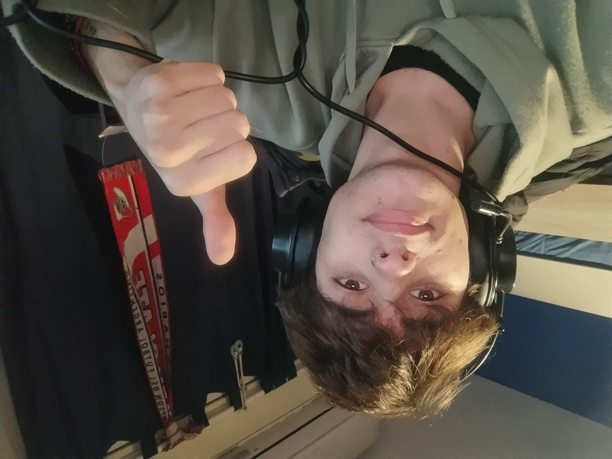

**Bienvenidos a**
# Mi presentación
~~~
Soy Facundo Torres, un aspirante a programador (o un programador en desarrollo, como prefieran decirle).
Estoy en mi segundo año de la carrera y desde que empece, cada cuatrimestre tengo mas ganas de poder trabajar
y seguir creciendo en todo lo que tenga que ver con el campo de la programación.
~~~

---

## Cosas acerca de mi:
- Me gusta jugar a la compu.
    + A lo que más juego es [Rainbow six](https://www.ubisoft.com/es-mx/game/rainbow-six/siege/game-info/discover#intro) y [Lol](https://www.leagueoflegends.com/es-mx/how-to-play/).
- Me gusta mucho escuchar música de distintos generos.
    + por lo general escucho _rock_, _indie_, _metal_ y _pop_.
    + Una de mis banda favoritas es [The Strokes](https://es.wikipedia.org/wiki/The_Strokes)
- Me gusta mucho trabajar en equipo.
- tambien me gusta mucho poder enseñar o ayudar a mis compañeros cuando entiendo bien el tema.

***
> [!NOTE]
> En un principio, antes de inscribirme en **programacion**, está carrera era el _plan B_ porque no conocía mucho, pero opte en inscribirme
> y no me arrepiento. Entre sabiendo poco y con dudas, pero desde que comence la carrera y me empece a adentrar mas en este mundo
> me enamore por completo, es una de mis pasiones.
